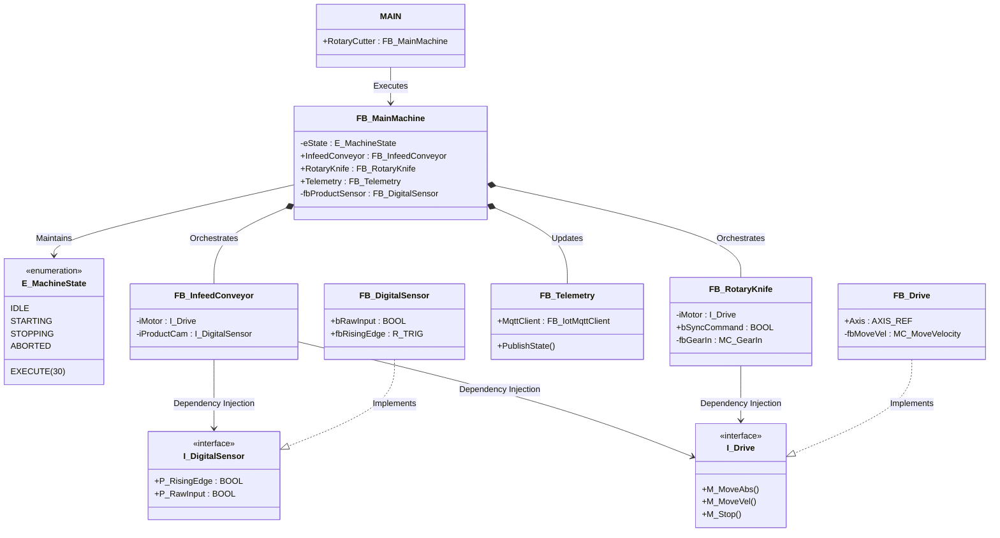
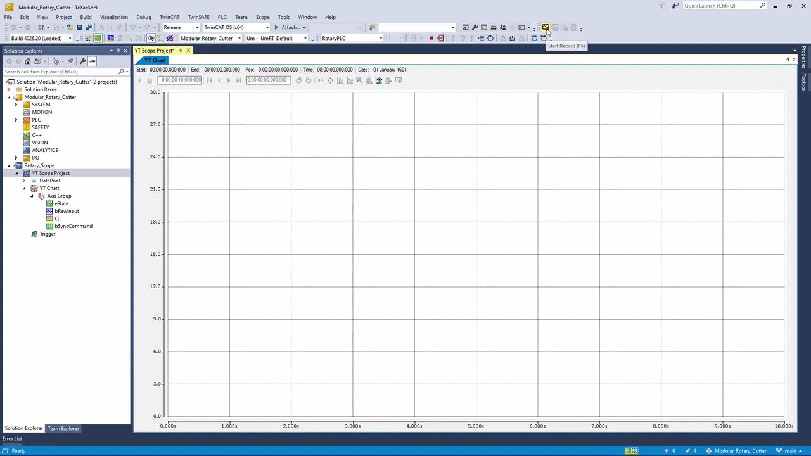

# Modular Rotary Cutter (Flying Shear)

High-Performance Industrial Control Logic with Python Digital Twin

## 1. Overview

This project implements a modular, object-oriented control system for a Rotary Cutter (Flying Shear) using TwinCAT 3 (Structured Text). It bridges the gap between Industrial Automation (OT) and Software Engineering (IT) by utilizing a Python-based Digital Twin for real-time physics simulation and closed-loop logic validation via ADS.

## 2. Technical Stack

- **Control System**: Beckhoff TwinCAT 3.1 (XAE)
- **Languages**: Structured Text (IEC 61131-3), Python 3.13
- **Architecture**: Object-Oriented Programming (OOP), Interface-based Dependency Injection
- **Communication**: ADS (Automation Device Specification), MQTT (TwinCAT IoT)
- **Standards**: PackML-inspired State Machine (`E_MachineState`)

## 3. System Architecture

The codebase is structured to ensure maximum modularity and hardware independence. Physical hardware is decoupled from the control logic using IEC 61131-3 Interfaces (`I_Drive`, `I_DigitalSensor`).



**FB_MainMachine**: Orchestrates the top-level state machine and module coordination.

**FB_InfeedConveyor**: Manages material transport. Utilizes I_Drive and I_DigitalSensor interfaces to decouple logic from physical I/O.

**FB_RotaryKnife**: Implements electronic gearing (Master/Slave synchronization) to synchronize cutting speed with conveyor velocity.

**FB_DigitalSensor**: Hardware wrapper for digital inputs with integrated edge detection (R_TRIG/F_TRIG).

## 4. Digital Twin & Simulation

To enable "Hardware-in-the-Loop" testing without physical components, a Python simulation is integrated directly into the PLC's real-time kernel:

- **Physics Simulation**: Python calculates deterministic workpiece flow and triggers concrete sensor instances (bRawInput) within the TwinCAT Router via pyads.
- **Closed-Loop Verification**: Python synchronously reads the PLC's response (bSyncCommand) immediately after sensor triggering to mathematically verify deterministic motion execution and state transitions.
- **Abstraction**: The PLC logic interacts strictly with interfaces (I_DigitalSensor), allowing for a seamless transition from the Python simulation directly to physical fieldbus commissioning without code changes.

## 5. System Demonstration & Validation

The following video demonstrates the full "Closed-Loop" execution of the Rotary Cutter. It showcases the high-speed synchronization between the Python Digital Twin and the TwinCAT 3 PLC.

### 5.1 Real-Time Execution Trace

**Quick Preview:**


**[📹 Watch High-Quality Video (MP4)](./docs/rotary%20motor%20scope%20view.mp4)**

**Python CLI Output (HIL Verification):**


**In this demonstration:**
* **Modular POU Structure**: Note the organized folder hierarchy (`01_Interfaces` through `06_IoT_Edge`) ensuring a clean, maintainable codebase.
* **Deterministic Logic**: The TwinCAT Scope (Logic Analyzer) shows the **Green Pulse (Edge Detection)** and **Pink Line (Knife Command)** firing in perfect synchronization.
* **HIL Simulation**: The Python CLI logs confirm that every virtual "Cut" is mathematically verified by reading back the PLC's state via ADS.

### 5.2 Timing Analysis
| Signal | Description | Logic Proof |
| :--- | :--- | :--- |
| **bRawInput** | Python Sensor | Injected via `pyads` at 1ms resolution. |
| **P_RisingEdge** | Edge Detection | Triggered for exactly one PLC task cycle. |
| **bSyncCommand** | Motion Trigger | High-speed output for knife synchronization. |
| **eState** | Machine State | Constant at `30` (Execute), proving logic stability. |

## 6. IoT & Telemetry

A dedicated FB_Telemetry module utilizes the TwinCAT IoT library to publish machine states to an MQTT broker.

- **Broker**: broker.hivemq.com (Default)
- **Payload**: JSON-formatted machine state and performance metrics sent at 2-second intervals.

## 7. Setup and Deployment

### Prerequisites

- TwinCAT 3.1 (eXtendible Automation Engineering)
- Python 3.10+ with pyads library

### Execution

**TwinCAT**: Open the .sln, build, and Activate Configuration. Ensure the PLC is in Run Mode (State 5 in ADS).

**Digital Twin**:
```bash
python 07_Digital_Twin/simulate_machine.py
```

**Monitoring**: Observe state transitions (eState) and closed-loop validation outputs directly in the Python CLI or via an MQTT client subscribing to the telemetry topic.
